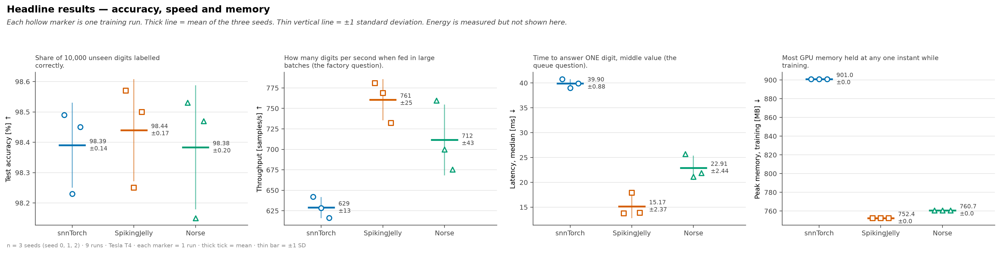
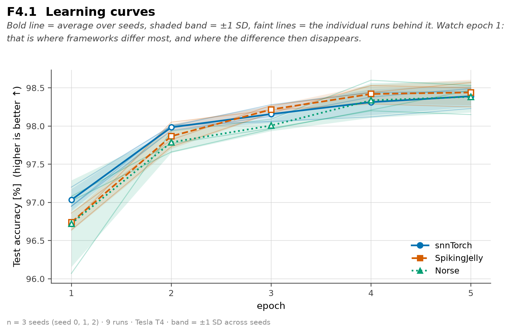

<div align="center">

# Same network. Three frameworks. What actually differs?

**A fair benchmark of [snnTorch](https://github.com/jeshraghian/snntorch) · [SpikingJelly](https://github.com/fangwei123456/spikingjelly) · [Norse](https://github.com/norse/norse)**

   

*Bachelor's thesis · work in progress · more experiments landing soon*

</div>

---

> ### TL;DR
> - 🎯 **Accuracy: a tie.** 98.39 / 98.44 / 98.38 % — the gap between frameworks is *smaller than one framework's own run-to-run wobble*.
> - ⚡ **Speed & memory: real gaps.** SpikingJelly answers one digit in **15 ms**, snnTorch takes **40 ms**. The ranges don't touch.
> - 🔬 **The hard part wasn't measuring.** It was proving the three neurons behave identically *first*. Most comparisons skip that.

---

## 🎯 The catch nobody mentions

All three libraries implement the same leaky neuron. None of them describe it the same way. For a membrane decay of **0.9 per step**:

| framework | you must write | its default gives you instead |
|:---|:---|:---|
| snnTorch | `beta = 0.9` | reset by *subtraction* — a different neuron |
| SpikingJelly | `tau = 10.0` | decay **0.5**, input gain **0.5** |
| Norse | `dt=0.001`, `tau_mem_inv=100` | a **second-order** neuron with extra state |

👉 Trust the defaults and you've compared three different neurons, then called it a framework comparison.

## 🧪 The strategy


| step | in one line |
|:---|:---|
| 1 · Define | threshold 1.0 · hard reset to 0 · decay 0.9 · gain 1.0 |
| 2 · Translate | every silent default overridden, per framework |
| 3 · **Verify** | same input → membrane traces agree to `1.2e-07`, the float32 limit |
| 4 · Share | one `SpikingNet` — `12C5–MP2–32C5–MP2–FC10`, 18,254 params, 20 steps — neuron injected |
| 5 · Measure | accuracy · time · throughput · latency · memory · spikes · energy |
| 6 · **Noise floor** | two of the three are *provably the same computation* → their measured gap **is** the noise |

**Step 6 is the whole point.** It's what lets this project say *"indistinguishable"* instead of quietly crowning a winner.

---

## 📊 Results — Experiment 1

<samp>N-MNIST · Tesla T4 · 5 epochs · 3 seeds × 3 frameworks = 9 runs · mean ± SD</samp>

| | snnTorch | SpikingJelly | Norse |
|:---|:---:|:---:|:---:|
| 🎯 test accuracy % | 98.39 ± 0.14 | 98.44 ± 0.17 | 98.38 ± 0.20 |
| ⚡ latency @ batch 1, ms | 39.9 ± 0.9 | **15.2 ± 2.4** | 22.9 ± 2.4 |
| 🚀 throughput, samples/s | 629 ± 13 | **761 ± 25** | 712 ± 43 |
| 💾 peak GPU memory, MB | 901.0 ± 0.0 | **752.4 ± 0.0** | 760.7 ± 0.0 |
| ⏱ training time, s | 610 ± 46 | **553 ± 22** | 629 ± 24 |
| 🔌 spike rate % | 2.57 ± 0.17 | 2.66 ± 0.19 | **2.21 ± 0.16** |

<sub>Accuracy is deliberately *not* bolded — declaring a winner there would misread the data.</sub>



Every hollow marker is **one real training run**, not a summary bar. So:

| | finding | the evidence |
|:---:|:---|:---|
| ✅ | **Accuracy is a tie** | 0.06 pp spread vs 0.14–0.20 pp own noise → **0.3× the noise floor** |
| ✅ | **Latency is real** | 15 / 23 / 40 ms, ranges never overlap → **13× the noise floor** |
| ✅ | **Memory is exact** | std of **0.0 MB** across seeds — deterministic, not a noisy measurement |
| ⚠️ | **Training speed: careful** | seed 0 alone showed a 10 % win that **vanished** with two more seeds |



Three frameworks, same destination, nearly the same path.

> 🔌 **Energy is measured but not interpreted yet.** It's in the CSVs — but it comes from the GPU's own sensor, it partly restates the speed result, and here the instrument contradicts itself between seeds. It gets a verdict once later experiments give it something to be compared against.

**Bonus finding:** 9 framework-level issues surfaced along the way — including **a bug in Norse's released surrogate gradient**, where a documented parameter does nothing at all.

---

## 🚧 Coming next

| | the question |
|:---|:---|
| **Experiment 2** | What do the **out-of-the-box defaults** actually do? The equivalence check is *expected to fail* — that failure **is** the result. |
| SpikingJelly, unleashed | Multi-step + `cupy`, the mode its paper claims 11× for. Every number above is a **lower bound** on its speed. |
| A second dataset | DVS128 Gesture — does any of this transfer off N-MNIST? |
| Neuron zoo | The specialised neurons each framework ships, and the surrogate gradient on its own. |
| Energy, properly | Revisited with a second axis to compare against. |

*This README is updated as results land.* Deferred items: [docs/open_items.md](docs/open_items.md).

---

<details>
<summary><b>🗂 Repository layout</b></summary>

<br>

| path | what it is |
|:---|:---|
| [src/network.py](src/network.py) | the one shared network — neuron injected, never duplicated |
| [src/adapters/](src/adapters/) | one adapter per framework, mapping the target neuron to that library |
| [src/metrics.py](src/metrics.py) | measurement primitives — timing, memory, energy, spike counting |
| [src/plots/](src/plots/) | the figure schema — dots for every run, ±1 SD, never bars |
| [equivalence_check.py](equivalence_check.py) | proves the **neurons** match, before anything is benchmarked |
| [check_network.py](check_network.py) | proves the **networks and initial weights** match |
| [train.py](train.py) | the measured run |
| [make_plots.py](make_plots.py) | regenerates every figure from the result CSVs |
| [how-to_run.md](how-to_run.md) | **start here to run anything** |
| [docs/metrics_reference.md](docs/metrics_reference.md) | what each recorded number means, and how |

</details>

<details>
<summary><b>▶️ Running it</b></summary>

<br>

Two flags define an experiment. Nothing else changes.

```bash
python -m pip install -r requirements.txt

python check_env.py                                                        # what am I on?
python check_network.py     --config config/default.yaml --experiment ex1 --all
python equivalence_check.py --config config/default.yaml --experiment ex1
python prepare_data.py      --config config/default.yaml --experiment ex1  # cache BEFORE timing
python train.py --config config/default.yaml --experiment ex1 --framework snntorch --seed 0
python make_plots.py --experiment ex1
```

`--config` is always required — no hidden defaults, so every run traces back to the file that defined it. Real runs happen on a Colab T4; the local environment is CPU-only and used for the checks. Full walkthrough: [how-to_run.md](how-to_run.md).

Result CSVs and experiment reports stay out of version control by choice — only the two figures above are committed. The code, configs and docs are everything needed to reproduce the numbers.

</details>

<details>
<summary><b>📚 References</b></summary>

<br>

- **Pedersen et al. (2024)**, *Neuromorphic Intermediate Representation*, Nat Commun 15:8122 — the trace-overlay verification approach borrowed here.
- **Fang et al. (2023)**, *SpikingJelly*, Sci Adv, [doi:10.1126/sciadv.adi1480](https://doi.org/10.1126/sciadv.adi1480).
- **Cheng, Hu, He & Huang (2025)**, *A comprehensive multimodal benchmark of neuromorphic training frameworks for SNNs*, Eng Appl AI, [doi:10.1016/j.engappai.2025.111543](https://doi.org/10.1016/j.engappai.2025.111543) — five frameworks, but **excludes snnTorch and Norse** and does not verify forward equivalence. That's the gap this project sits in.
- **Weissgerber et al. (2015)**, *Beyond bar and line graphs* — why every figure here plots individual runs.

</details>
