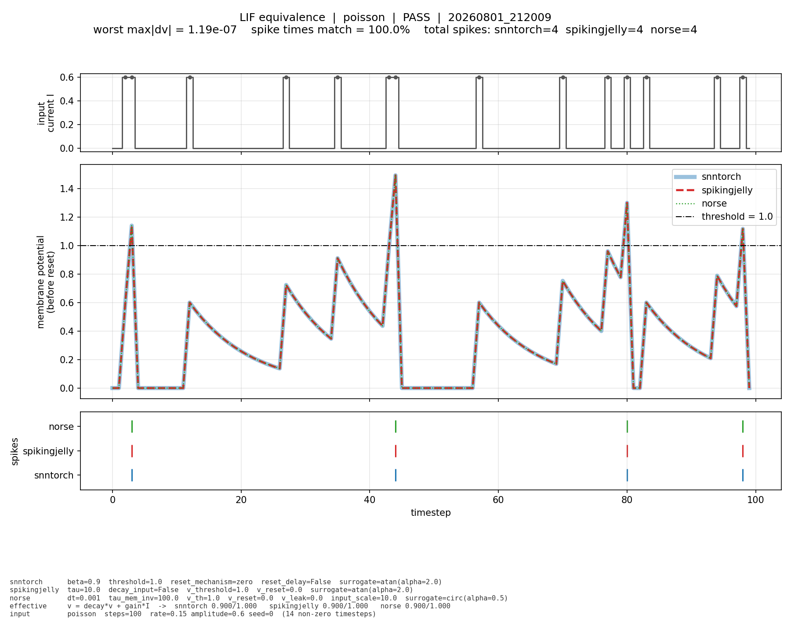

# Experiment 1 — Fair baseline on N-MNIST

Comparing **snnTorch, SpikingJelly and Norse** by running the *same* network on
all three and changing only the framework.

Run 2026-08-01 → 2026-08-02 · Tesla T4 · **seeds 0, 1, 2 — 9 runs** · 5 epochs

---

## 1. Summary

All figures are **mean ± std over three seeds**. Every framework was run three
times from three different random starting points; the ± is how much the number
moved between them (§5.6 explains this from scratch).

- **Accuracy is indistinguishable across all three.** 98.39 / 98.44 / 98.38 %. The
  gap between the best and worst framework is **0.06 pp — smaller than a single
  framework's own run-to-run wobble (0.14–0.20 pp)**. No framework is more
  accurate, and three seeds are what let us say that rather than guess it.
- **Latency is a real, cleanly separated difference.** SpikingJelly 15.2 ms,
  Norse 22.9 ms, snnTorch 39.9 ms at batch size 1 — the three ranges do not
  overlap at all.
- **SpikingJelly trains fastest — but snnTorch and Norse cannot be separated.**
  610 ± 46 s vs 629 ± 24 s overlap heavily. **Seed 0 alone said otherwise** (559 s
  vs 618 s looked decisive), and that apparent gap did not survive the extra
  seeds. This is the clearest illustration in the report of why one run is not
  enough.
- **Peak memory is byte-identical across all three seeds** — std of exactly 0.0 MB.
  It is a deterministic property of each implementation, not a measurement subject
  to noise.
- **Norse is genuinely sparser**, 2.21 % vs 2.57 / 2.66 %, and this replicates in
  every seed. Meanwhile snnTorch and SpikingJelly — which are *provably the same
  computation* — are statistically indistinguishable from each other, exactly as
  they should be. That agreement is a check on the method, not a null result.
- **Energy is recorded but not interpreted here** (§5.3). Beyond the general
  instrument caveats, this data set contains a direct self-contradiction: snnTorch's
  seed 2 run trained the **longest** of its three yet recorded the **lowest**
  dynamic energy.
- **The neurons were verified to behave identically before any benchmarking** —
  agreement to `1.2e-07`, the limit of 32-bit arithmetic.
- Nine framework-level issues were found along the way, including **a bug in
  Norse's released surrogate gradient** (§6).

| | snnTorch | SpikingJelly | Norse |
|---|---|---|---|
| accuracy % | 98.39 ± 0.14 | 98.44 ± 0.17 | 98.38 ± 0.20 |
| training time s | 610 ± 46 | **553 ± 22** | 629 ± 24 |
| throughput /s | 629 ± 13 | **761 ± 25** | 712 ± 43 |
| latency bs=1, ms | 39.9 ± 0.9 | **15.2 ± 2.4** | 22.9 ± 2.4 |
| spike rate % | 2.57 ± 0.17 | 2.66 ± 0.19 | **2.21 ± 0.16** |
| peak memory MB | 901.0 ± 0.0 | **752.4 ± 0.0** | 760.7 ± 0.0 |
| dynamic energy kJ | 9.7 ± 1.3 | 8.4 ± 0.5 | 13.1 ± 0.3 |

*Accuracy is deliberately not bolded — declaring a winner there would misread the
data.* Energy is greyed out in intent, not formatting: see §5.3.

---

## 2. What this experiment is

### The problem

snnTorch, SpikingJelly and Norse are three software libraries for building
**spiking neural networks** — networks whose neurons communicate with discrete
events (spikes) over time, rather than passing continuous numbers in one shot.

The basic neuron is simple. Each timestep it:

1. **leaks** — forgets part of what it was holding,
2. **accumulates** — adds the incoming signal,
3. **fires** a spike if it crosses a threshold, then **resets**.

All three libraries implement this same neuron. **But each one names and
parameterises it differently**, so writing "the same neuron" in three libraries
does not mean writing the same numbers.

For a decay of 0.9 per step:

| | you write |
|---|---|
| snnTorch | `beta = 0.9` |
| SpikingJelly | `tau = 10.0` (because decay = 1 − 1/τ) |
| Norse | `dt = 0.001`, `tau_mem_inv = 100` (because decay = 1 − dt·τ⁻¹) |

Three different numbers for one behaviour. And the defaults differ too — leave
them alone and you get three genuinely different neurons (§3).

### What we did

1. Defined **one target neuron**: threshold 1.0, hard reset to 0, decay 0.9,
   input gain 1.0.
2. Expressed that neuron in each library's own parameters.
3. **Verified it worked** — fed one neuron per library the identical input and
   checked the membrane voltages and spike times matched (§4).
4. Built **one** network class, shared by all three, with only the neuron swapped.
5. Trained all three on identical data with identical weights, and measured.

### What can therefore differ

Only the library's implementation: how fast it runs, how much memory it holds,
how much energy it burns. Everything scientific — the neuron, the network, the
weights, the data, the optimiser — is held equal by construction.

**Network:** `12C5 – MP2 – 32C5 – MP2 – FC10`, 18,254 parameters, 20 timesteps.
**Data:** N-MNIST — handwritten digits recorded with an event camera, 60,000
train / 10,000 test, 34×34 pixels, 2 polarities.

---

## 3. What was held constant

Full table in `../../docs/controlled_variables.md`. The neuron is the part that
matters.

**Target: threshold 1.0 · hard reset to 0 · decay 0.9 · input gain 1.0**

| property | snnTorch | SpikingJelly | Norse |
|---|---|---|---|
| class | `snn.Leaky` | `LIFNode` | `LIFBoxCell` |
| decay 0.9 | `beta=0.9` | `tau=10.0` | `dt=0.001 × tau_mem_inv=100` |
| gain 1.0 | native | `decay_input=False` | `input_scale=10.0` |
| hard reset | `reset_mechanism="zero"` | `v_reset=0.0` | `reset_method="value"` |
| reset timing | `reset_delay=False` | native | native |
| surrogate gradient | `atan(2.0)` | `ATan(2.0)` | `circ(0.5)` |

**Defaults we had to override.** Each would have broken the comparison silently:

| framework | default | effect if left alone |
|---|---|---|
| snnTorch | `reset_mechanism="subtract"` | soft reset — a different neuron |
| snnTorch | `reset_delay=True` | reset applied one timestep late |
| SpikingJelly | `tau=2.0` | decay 0.5 instead of 0.9 |
| SpikingJelly | `decay_input=True` | input gain 0.5 instead of 1.0 |
| SpikingJelly | `Sigmoid(α=4)` | different gradients |
| Norse | `LIFCell` | **second-order** neuron with extra state |
| Norse | gain locked to 0.1 | inputs 10× weaker |

Identical by construction: one `SpikingNet` class shared by all three with only
the neuron injected; PyTorch default weight init under the run's seed, verified
byte-identical across the three frameworks within each seed (§4.3);
`torch.optim.NAdam` at lr 2e-3; `torch.nn.CrossEntropyLoss` on spike counts; one
shared Tonic disk cache.

---

## 4. Verification: do the neurons actually behave the same?

Framework comparisons normally assume the neurons match. We measured it, using
the approach of the NIR paper [[3]](#references), which overlaid voltage traces
across platforms.

**Method.** One LIF neuron per library. Feed all three the identical input
current. Record the membrane voltage at every timestep and every spike time.

### 4.1 Result

| test | input | spikes (all three) | first spike | worst disagreement | spike times |
|---|---|---|---|---|---|
| constant step | 0.15 held from t=10 | 8 | t = 20 | **1.19e-07** | **100 %** |
| Poisson | random, rate 0.15, amp 0.6 | 4 | t = 3 | **1.19e-07** | **100 %** |

`1.1920929e-07` is exactly **2⁻²³ — the smallest gap two 32-bit floats can
have**. The traces are as identical as the number format permits. snnTorch and
SpikingJelly agree to **exactly zero**; Norse differs by one bit in the last
place because it reaches the same value by a different arithmetic route.

### 4.2 The Poisson test

The realistic case — irregular input, like a real event camera.



Reading the figure:

- **Top:** the input. Discrete events, on for one timestep at a time.
- **Middle:** the membrane voltage of all three neurons. **Three curves are
  plotted; you see one.** snnTorch is the thick blue line, SpikingJelly the red
  dashes drawn over it, Norse the green dots over that. Charge, leak, cross the
  threshold, reset — in lockstep.
- **Bottom:** spike times. Four spikes each, same timesteps.

The equivalent constant-input test, and the raw pass/fail data, are in
`equivalence/`.

### 4.3 Network level

| check | result |
|---|---|
| weight fingerprint (sha256 of all trainable parameters) | **identical for all three, within every seed** — `30b4902cd20a39fe` (seed 0), `b80dbce09b1ebb09` (seed 1), `5f2de8c28fc112b2` (seed 2) |
| trainable parameters | 18,254 — identical (the neuron layers contribute none) |
| flatten size | 800, measured by a dummy forward pass rather than hardcoded |

So all three networks started training from byte-identical weights — and this was
re-confirmed independently in each of the three seeds, nine runs in total. The
fingerprint also *changed* between seeds, which confirms the seed argument actually
took effect. See §5.6.

---

## 5. Results

Every metric below opens with a short **"what this is"** block — in plain words,
what the instrument actually measured and why it is worth measuring — before any
numbers appear. Nothing assumes statistics vocabulary.

**How to read every table in this section.** Each metric is given twice:

1. **mean ± std over the three seeds** — the headline number, the one to quote.
2. **the three individual seeds** — so nothing is hidden behind an average. An
   average of three can conceal a run that went sideways; these tables let you see
   whether the three agreed or scattered.

§5.6 then tells the story of what the three seeds actually changed, and explains
seed, mean and std from scratch.

### 5.1 Accuracy

> **What this is.** Out of the 10,000 test digits the network was never trained
> on, how many did it label correctly. 98.39 % means about 9,839 right, 161 wrong.
>
> **Why measure it.** It is the sanity check on fairness. All three frameworks
> are supposed to be computing the same network, so all three should land in the
> same place. If one came out clearly worse, that would be a sign something was
> misconfigured — not a sign that library is weaker.
>
> **Test set, not training set.** The network has seen the 60,000 training digits
> thousands of times, so its score on those is flattering and meaningless. These
> 10,000 are held back and only used to score.
>
> **"pp" = percentage points.** The plain gap between two percentages. 98.49 to
> 98.57 is 0.08 pp. Written this way to avoid confusion with "8 % higher".

**Final accuracy, mean ± std over 3 seeds:**

| | snnTorch | SpikingJelly | Norse |
|---|---|---|---|
| accuracy % | 98.39 ± 0.14 | 98.44 ± 0.17 | 98.38 ± 0.20 |

**Per seed:**

| | seed 0 | seed 1 | seed 2 | spread |
|---|---|---|---|---|
| snnTorch | 98.49 | 98.23 | 98.45 | 0.26 |
| SpikingJelly | 98.57 | 98.25 | 98.50 | 0.32 |
| Norse | 98.53 | 98.15 | 98.47 | 0.38 |
| **spread across frameworks** | **0.08** | **0.10** | **0.05** | |

Read that bottom row against the right-hand column. **Every framework moves more
between seeds (0.26–0.38 pp) than the frameworks differ from each other within any
one seed (0.05–0.10 pp).** The choice of starting point matters roughly four times
more than the choice of library. Note also that seed 1 was the weak seed for *all
three at once* — they rise and fall together, which is what you expect when the
libraries are computing the same thing and only the starting point changed.

**Accuracy per epoch, mean ± std over 3 seeds:**

| epoch | snnTorch | SpikingJelly | Norse |
|---|---|---|---|
| 1 | 97.03 ± 0.14 | 96.74 ± 0.11 | 96.72 ± 0.57 |
| 2 | 97.98 ± 0.04 | 97.87 ± 0.17 | 97.79 ± 0.14 |
| 3 | 98.16 ± 0.11 | 98.22 ± 0.05 | 98.01 ± 0.07 |
| 4 | 98.31 ± 0.17 | 98.42 ± 0.12 | 98.34 ± 0.23 |
| 5 | 98.39 ± 0.14 | 98.44 ± 0.17 | 98.38 ± 0.20 |

All three plateau by epoch 4, and all three arrive at the same place.

**A claim the extra seeds corrected.** The single-seed version of this report said
*"Norse starts slower, catches up by epoch 3."* That was true of seed 0 only, where
Norse's first epoch came in at 96.07 %. In seeds 1 and 2 it reached 97.08 % and
97.02 % — ahead of the others. The ± 0.57 on Norse's epoch 1 is by far the largest
wobble in this table and is what gives it away: **Norse's slow start was a property
of one particular random initialisation, not of Norse.** Stated as a framework
characteristic, it would have been wrong.

### 5.2 Speed

> **Three different questions, three different numbers.** "Fast" is not one
> thing, so it is measured three ways.
>
> **Training time** — a stopwatch. Started when training begins, stopped after
> the fifth epoch finishes. Wall clock, exactly as a person waiting would
> experience it.
>
> **Throughput** — digits are fed in groups of 128 and we count how many get
> processed per second. This is the *factory* question: how much work per hour if
> you have a huge pile of it.
>
> **Latency** — the network is handed **one single digit** and we time how long
> until it answers. This is the *queue* question: how long does one customer
> wait.
>
> **Why both, when one looks like the other flipped upside down.** They are not.
> A GPU has thousands of small processors. Give it 128 digits at once and they all
> work together, so the cost per digit is tiny. Give it one digit and most of the
> chip sits idle while the surrounding Python code does its bookkeeping — so the
> single digit is dominated by overhead that the group of 128 shared out. A
> framework can be excellent at one and poor at the other, and snnTorch here is
> exactly that case. Which number matters depends on the job: sorting a stored
> dataset is a throughput job, reacting to a live event camera is a latency job.
>
> **Median and 90th percentile.** The single-digit test is repeated many times
> and the timings vary, so one number is reported two ways.
> *Median* = line every timing up smallest to largest and take the middle one:
> half were faster, half slower. It ignores freak outliers.
> *90th percentile* = the value that 9 out of 10 timings came in under. It
> deliberately catches the occasional slow one, because on a live system the
> occasional slow one is what people notice.

**Mean ± std over 3 seeds:**

| | snnTorch | SpikingJelly | Norse |
|---|---|---|---|
| training, 5 epochs | 610.3 ± 45.9 s | **553.0 ± 22.4 s** | 628.6 ± 24.4 s |
| per epoch | 122.1 ± 9.2 s | **110.6 ± 4.5 s** | 125.7 ± 4.9 s |
| throughput | 629 ± 13 /s | **761 ± 25 /s** | 712 ± 43 /s |
| latency, median | 39.90 ± 0.88 ms | **15.17 ± 2.37 ms** | 22.91 ± 2.44 ms |
| latency, 90th percentile | 44.72 ± 0.40 ms | **25.21 ± 0.88 ms** | 26.51 ± 3.27 ms |

**Per seed:**

| | seed 0 | seed 1 | seed 2 |
|---|---|---|---|
| **training time s** | | | |
| snnTorch | 559.0 | 624.5 | 647.4 |
| SpikingJelly | 527.2 | 566.2 | 565.7 |
| Norse | 617.9 | 656.5 | 611.5 |
| **throughput /s** | | | |
| snnTorch | 642 | 628 | 616 |
| SpikingJelly | 781 | 769 | 732 |
| Norse | 760 | 700 | 676 |
| **latency median ms** | | | |
| snnTorch | 40.77 | 39.01 | 39.92 |
| SpikingJelly | 13.75 | 17.91 | 13.85 |
| Norse | 25.70 | 21.14 | 21.90 |

Both throughput and latency follow MLPerf's definitions [[1]](#references):
throughput = samples/s with batching (*Offline*), latency = one sample at a time
(*Single-Stream*).

#### What holds and what does not

**First, how to compare fairly.** Two readings are possible and they disagree, so
it matters which one is used.

- **Across seeds** — compare the mean ± std bands. This lumps in the fact that the
  three seeds ran in different Colab sessions, on different T4s, with different
  neighbouring workloads. It is the *conservative* reading.
- **Within a seed** — compare the three frameworks against each other inside each
  seed, then check whether the ordering repeats. All three ran back-to-back in the
  same session on the same machine, so session-to-session drift cancels out. This
  is the *paired* reading, and for speed it is the more informative one.

Both are given below, because a claim that survives both is on much firmer ground
than one that survives only the second.

**Latency holds under both readings, decisively.** Bands: snnTorch 39.0–40.8,
Norse 20.5–25.4, SpikingJelly 12.8–17.5 — **they do not touch.** And the
within-seed ordering `SpikingJelly < Norse < snnTorch` is identical in all three
seeds. snnTorch is ~2.6× slower than SpikingJelly on a single sample, and that is a
property of the library.

**Training time: SpikingJelly is fastest, but only the paired reading proves it.**
Within every seed the ordering puts SpikingJelly first — 527 < 559, 566 < 625,
566 < 612 — three for three. Across seeds, however, its band (531–575 s) does
*overlap* snnTorch's (564–656 s) at the top end, and in raw numbers snnTorch's seed-0
run (559 s) beat SpikingJelly's seed-1 and seed-2 runs (566 s). **That overlap is
session drift, not framework overlap**, which is exactly what the paired reading is
for. Claim retained, with the reasoning stated.

**snnTorch vs Norse on training time collapses under both readings.** 610 ± 46 s vs
629 ± 24 s overlap almost entirely, *and* the pair swaps places between seeds —
snnTorch faster in seeds 0 and 1, Norse faster in seed 2. There is no ranking to be
had.

This is the single most valuable thing the extra two seeds bought. Seed 0 alone read
559 s vs 617.9 s — a 10.5 % gap that looks like a finding. **A one-seed report would
have published a false ranking**, and nothing inside seed 0 could have revealed it.

**Throughput: snnTorch is clearly last; SpikingJelly over Norse is probable.**
snnTorch never overlaps anything (616–642 across all nine runs). SpikingJelly beats
Norse in all three seeds (781 vs 760, 769 vs 700, 732 vs 676), so the paired reading
is unanimous — but the margin shrinks from 21 to 56 /s and the bands (736–786 vs
669–755) do overlap. Norse also declines steadily across seeds (760 → 700 → 676) in
a way its training time does not mirror, which is unexplained. Treat this as
**probable, not established.**

Note that snnTorch's weakness flips depending on the question: **worst at latency by
a wide margin, yet mid-pack on training time.** §7.2 explains why, and the stds
support the explanation.

### 5.3 Energy

> **What this is.** How much electricity the GPU used while training. Measured in
> joules — the same kind of unit as the kJ on a food label. It is a *total*, not a
> rate: a bill, not a speed.
>
> **Watts vs joules.** Watts is how hard the chip is working *right now*. Joules
> is watts multiplied by seconds — the whole bill at the end. This is why a slower
> framework can lose twice over: more seconds on the clock *and* more watts while
> the clock runs.
>
> **Total vs dynamic.** A GPU draws power even when it is doing nothing at all —
> about 28 W here — the way a car burns fuel idling at a red light.
> *Total* = everything the sensor saw during training.
> *Dynamic* = total minus what pure idling for that same length of time would have
> cost. Dynamic is the interesting one, because it isolates the cost of the actual
> work from the cost of merely having the GPU switched on.
>
> **Cold vs hot idle.** Idle power is measured twice, once before training and
> once after. A warm chip leaks more current than a cold one, so idle drifts
> upward by a few watts purely from temperature. Both are recorded so the
> subtraction above uses a realistic baseline rather than a flattering one.
>
> **Where the number comes from.** The GPU's own built-in power sensor, polled
> through NVIDIA's management library. There is no external power meter in this
> setup — which is the whole reason for the caution below.

**Mean ± std over 3 seeds:**

| | snnTorch | SpikingJelly | Norse |
|---|---|---|---|
| total | 30.6 ± 1.3 kJ | 27.9 ± 1.0 kJ | 35.0 ± 1.3 kJ |
| dynamic | 9.7 ± 1.3 kJ | 8.4 ± 0.5 kJ | 13.1 ± 0.3 kJ |
| mean dynamic power | 13.99 ± 2.46 W | 13.39 ± 0.75 W | 18.35 ± 0.83 W |

**Per seed, dynamic energy (kJ):**

| | seed 0 | seed 1 | seed 2 |
|---|---|---|---|
| snnTorch | 10.11 | 10.66 | **8.23** |
| SpikingJelly | 8.31 | 8.93 | 8.03 |
| Norse | 12.79 | 13.21 | 13.28 |

**Idle baselines, cold → hot (W):**

| | seed 0 | seed 1 | seed 2 |
|---|---|---|---|
| snnTorch | 27.3 → 31.1 | 26.2 → 30.1 | 26.3 → 29.1 |
| SpikingJelly | 29.6 → 31.3 | 31.6 → 31.3 | 30.6 → 30.1 |
| Norse | 28.0 → 31.0 | 28.2 → 30.9 | 30.2 → 30.0 ⚠ |

Idle power generally rose ~3 W between cold and hot, purely from temperature —
measuring both mattered. But not always: in seed 2 the hot baseline came in *below*
the cold one twice, which a temperature-only story does not explain.

⚠ **One run carries an explicit validity warning.** Norse seed 2 recorded an
unstable idle baseline — range 29.7–49.1 W around a mean of 30.0 W — so the
subtraction that produces its dynamic figure inherits that uncertainty. It is the
only warning in the nine runs, and it is retained in the table rather than dropped.

> ### ⚠ Energy is reported here, not yet interpreted
>
> **Deliberate decision.** These energy numbers are recorded, and the basic plots
> agreed for this experiment are built from them — but **no conclusion is drawn
> from energy in this report.** Four reasons, the last one supplied by this data
> set itself:
>
> 1. The figures come from the GPU's on-board sensor, which updates only ~10 times
>    a second and is known to disagree with a real power meter by a wide margin
>    (L6). They support "A drew more than B on this machine, measured the same
>    way" — nothing stronger.
> 2. Energy is not an independent measurement. It is largely time multiplied by
>    power, so it partly restates §5.2 rather than adding a new axis.
> 3. A single dataset on a single shared cloud GPU is too narrow a base for an
>    efficiency claim, which is the claim energy is usually wheeled out to make.
> 4. **The three seeds caught the instrument contradicting itself.** snnTorch's
>    seed 2 run took the **longest** of its three (647 s vs 559 s in seed 0) and yet
>    recorded the **lowest** dynamic energy (8.23 kJ vs 10.11 kJ) — a 19 % drop
>    while doing 16 % more work. That is not physically sensible, and the cause is
>    visible in the table above: seed 2's idle baseline was ~2 W lower, and 2 W
>    subtracted over 735 s removes about 1.5 kJ on its own. **The dynamic figure is
>    dominated by the baseline estimate rather than by the framework.**
>
> Note too that the precision is wildly uneven — Norse's three runs agree to
> ± 0.26 kJ while snnTorch's scatter by ± 1.28 kJ, five times wider. A measurement
> whose reliability depends on which framework it is pointed at is not yet ready to
> carry an argument.
>
> **Therefore:** treat §5.3 as raw instrument output for the record. Energy is
> picked up properly once later experiments give it something to be compared
> against — and reason 4 says what to fix first: pin down the idle baseline.
> Any energy wording in §1 and §7 is phrased as observation, not finding.

### 5.4 Spiking activity

> **What this is.** How talkative the neurons are.
>
> Each digit is shown to the network over 20 timesteps, so every neuron gets
> **20 opportunities to fire**. The spike rate is simply the share of those
> opportunities it actually used. 2.5 % means a neuron stayed silent about
> 97.5 % of the time.
>
> **The same number, said a second way.** 2.5 % of 20 opportunities is 0.5 spikes
> per neuron per digit. Same measurement, more intuitive unit — "on average each
> neuron fires roughly once every two digits". Both are given because published
> papers use both.
>
> **Why this is worth measuring at all.** On neuromorphic hardware, a neuron that
> does not fire costs almost nothing — no spike, no message sent, no energy spent.
> The entire promise of spiking networks is *the same job done with fewer spikes*.
> So a lower rate at equal accuracy is a genuine win, not a shortfall.
>
> **Reported per layer as well as overall.** The overall figure averages across
> the whole network, which hides a lot: the big early layer dominates the average
> simply because it has thousands of neurons. Per-layer values show where the
> activity actually sits.
>
> **A caution about the small layer.** Layer 2 has only 10 neurons. Averages over
> 10 things bounce around far more than averages over 10,800, so its percentages
> look dramatic without meaning much. See §7.2.

**Mean ± std over 3 seeds:**

| | snnTorch | SpikingJelly | Norse |
|---|---|---|---|
| overall | 2.567 ± 0.169 % | 2.661 ± 0.193 % | **2.211 ± 0.159 %** |
| in spikes per neuron per digit | 0.513 | 0.532 | **0.442** |
| layer 0 (10,800 neurons) | 2.624 ± 0.186 % | 2.823 ± 0.263 % | **2.128 ± 0.216 %** |
| layer 1 (3,872 neurons) | 2.387 ± 0.198 % | **2.192 ± 0.183 %** | 2.426 ± 0.126 % |
| layer 2 (10 neurons) | 10.187 ± 1.679 % | 9.405 ± 0.741 % | **9.271 ± 0.740 %** |

**Per seed, overall spike rate (%):**

| | seed 0 | seed 1 | seed 2 |
|---|---|---|---|
| snnTorch | 2.485 | 2.761 | 2.454 |
| SpikingJelly | 2.455 | 2.837 | 2.691 |
| Norse | **2.055** | **2.372** | **2.207** |

**Norse is sparsest in every single seed** — that is the finding, and it is
unanimous across nine runs. Norse's band (2.05–2.37) sits clear of snnTorch's
(2.40–2.74) and SpikingJelly's (2.46–2.84).

**The negative result here is just as informative.** snnTorch and SpikingJelly are
configured to compute *exactly* the same function (§4.1: their membrane traces
agree to zero). If the method is sound, they should be statistically
indistinguishable — and they are: 2.567 ± 0.169 vs 2.661 ± 0.193, a 0.094 gap
against stds nearly twice that size. They even swap places between seeds (snnTorch
higher in seed 0, lower in seeds 1 and 2). **So the pipeline correctly reports "no
difference" where no difference exists, which is what earns trust in the Norse gap
it does report.** In the single-seed report this pair differed by 0.03 pp and that
was used as the noise estimate; with three seeds we can see the pairing behaves as
predicted.

Norse's sparsity is attributable to its different surrogate gradient — `circ(0.5)`
rather than ATan(2), the closest available match (§6.4) — not to "Norse" as such.

**All three became sparser while getting more accurate** (mean over 3 seeds):

| | epoch 1 | epoch 5 | change |
|---|---|---|---|
| snnTorch | 3.054 % | 2.567 % | −16 % |
| SpikingJelly | 3.104 % | 2.665 % | −14 % |
| Norse | 2.661 % | 2.219 % | −17 % |

Training does not merely improve accuracy — it also finds a *quieter* solution, in
every framework. The single-seed figures suggested Norse sparsified noticeably more
than the others (−22 % vs −13 %); averaged over three seeds that distinction mostly
disappears (−17 % vs −16 / −14 %). All three sparsify at much the same rate.

### 5.5 Memory

> **What this is.** The **high-water mark** — the most GPU memory in use at any
> single instant during the run. Not the average, and not a total added up over
> time. The peak is what matters in practice, because a model that exceeds the
> card's memory for even one instant crashes.
>
> **Allocated vs reserved.**
> *Allocated* = memory the actual numbers occupied.
> *Reserved* = memory PyTorch claimed from the graphics driver up front, so it
> would not have to keep asking for more mid-training. Reserved is always the
> larger figure, and it is the one that is genuinely unavailable to anything else
> on the card. Allocated is the fairer measure of what the framework *needs*;
> reserved is what it *occupies*.
>
> **Why training needs far more than inference.** To learn, the network must keep
> intermediate values from the forward pass so it can work backwards through them
> afterwards. With 20 timesteps that is 20 sets of values held at once. Just
> answering — inference — can discard each timestep as soon as it is done, which is
> why the inference figures are roughly ten times smaller.

**Mean ± std over 3 seeds:**

| | snnTorch | SpikingJelly | Norse |
|---|---|---|---|
| allocated, training | 901.0 ± 0.0 MB | **752.4 ± 0.0 MB** | 760.7 ± 0.0 MB |
| reserved, training | 958 ± 0 MB | **822 ± 0 MB** | 842 ± 0 MB |
| allocated, inference | 87.6 ± 0.0 MB | **68.6 ± 0.0 MB** | 91.9 ± 0.0 MB |

**Per seed:** every framework returned the *identical* figure in all three seeds —
901.0 / 752.4 / 760.7 MB, to the byte, nine runs out of nine. There is no per-seed
table worth printing because there is no variation to show.

**Why the zero matters.** Every other metric in this section wobbles between seeds,
because timing depends on a shared cloud machine and accuracy depends on where
training started. Memory does neither. The peak is decided by the *shape* of the
computation — how many intermediate values must be held for the backward pass —
and that shape is fixed by the code, not by the random draw. So a std of exactly
0.0 is not a suspiciously clean result; it is the expected one, and getting it is
a quiet confirmation that the three runs really were configured identically.

It also makes the comparison unusually safe: **snnTorch needs 148.5 MB more than
SpikingJelly for the same network, and no amount of extra seeds will soften that.**
It is the only difference in this report with no uncertainty attached at all.

### 5.6 The story the three seeds tell

> **What this is.** The same metrics as above, but measured three times from three
> different random starting points, then summarised as one number plus a wobble.
>
> **Seed.** The network starts with random weights, and the training digits are
> shown in a random order. Computers cannot make true randomness, so they use a
> formula, and the **seed** is the number that formula starts from. Same seed →
> the exact same "random" weights and the exact same shuffle, every time. A
> different seed → a different starting point. So a seed is a *label for one
> particular starting point*, and `--seed 0/1/2` are three of them.
>
> **Mean** = the plain average of the three runs.
>
> **Std** (standard deviation) = how spread out those three runs were around the
> average. Small std → the runs agreed closely. Large std → they scattered.
>
> **Why this section exists — the whole point.** With one run you cannot tell a
> real difference from luck. Seed 0 had SpikingJelly 0.08 pp above snnTorch; is
> SpikingJelly better, or did snnTorch just draw unlucky starting weights? The
> only way to find out is to start again somewhere else. And when we did, *both*
> frameworks dropped by about 0.3 pp — a bigger move than the gap between them.
> That is the finding: **changing the starting point moves accuracy more than
> changing the framework does.**
>
> **What the ± buys you.** It is the amount a number is allowed to wobble for
> reasons that have nothing to do with the framework. Once it is known, comparisons
> stop being arguable and become decidable, using the actual figures from this
> experiment:
>
> - accuracy, best vs worst framework: **0.06 pp gap against a ± of 0.14–0.20** →
>   sits inside the wobble → **no winner, and saying so is the result**.
> - latency: **39.9 vs 15.2 ms against a ± of at most 2.4** → the gap is ten times
>   the wobble → **real, and can be ranked**.
> - training time, snnTorch vs Norse: **610 vs 629 s against a ± of 46 and 24** →
>   inside the wobble → **no ranking available**, even though seed 0 alone made it
>   look like there was one.
>
> Same three seeds, three different verdicts. Without the ± all three of those
> comparisons would have looked equally reportable.
>
> **Why three and not two.** Two runs give you a difference; three are the minimum
> that give you a spread you can put a number on. It is not a magic figure — it is
> the smallest honest one, and it fits the ~45 min-per-seed budget. Three is also
> enough to notice when one run is the odd one out, which two never is.

#### The story, in order

**Chapter 1 — seed 0 looked like a clean sweep.** One run of each framework
produced a tidy narrative: SpikingJelly fastest at everything, snnTorch slow on
latency, Norse slowest to train and sparsest. Accuracy came out 98.49 / 98.57 /
98.53 %. Every number had one measurement behind it and nothing visible to
contradict it. A report could have been written on this, and three of its claims
would have been wrong or unsupportable.

**Chapter 2 — seed 1 moved everything at once.** Accuracy fell for *all three*
frameworks together (98.23 / 98.25 / 98.15 %), by 0.26–0.38 pp. That simultaneous
movement is the important part: it cannot be a framework property, because all
three libraries changed in the same direction by a similar amount when the only
thing altered was the random starting point. This is what first showed that the
starting point was a bigger lever than the library.

**Chapter 3 — seed 2 settled which differences were real.** Accuracy came back up
(98.45 / 98.50 / 98.47 %), roughly to seed 0's level, confirming seed 1 as an
unlucky draw rather than a trend. And with three points the wobble could finally be
put in numbers — at which point each claim from Chapter 1 could be tested:

| Chapter 1 claim | verdict after 3 seeds |
|---|---|
| SpikingJelly trains fastest | **holds** — fastest in all three seeds, band clears the others |
| snnTorch has the worst single-sample latency | **holds decisively** — bands do not overlap at all; true in 9/9 runs |
| Norse is the sparsest | **holds** — sparsest in all three seeds |
| snnTorch trains faster than Norse | **collapses** — 610 ± 46 vs 629 ± 24 s overlap, and they swap places between seeds |
| Norse starts slow and catches up | **collapses** — true only in seed 0; Norse led at epoch 1 in the other two |
| Norse sparsifies more during training (−22 % vs −13 %) | **collapses** — −17 % vs −16 / −14 % once averaged |
| SpikingJelly beats Norse on throughput | **unresolved** — bands overlap at the edges; likely but not established |
| Norse uses 54 % more energy | **set aside** — the instrument contradicted itself in seed 2 (§5.3) |
| accuracy differences are within noise | **holds, and is now quantified** rather than argued |
| peak memory is identical across frameworks-per-seed | **holds exactly** — std 0.0 MB over nine runs |

**Three of nine claims did not survive, and one more became doubtful.** None of
them could have been caught from inside seed 0. That is the return on ~45 minutes
per extra seed.

#### What the ± is made of

The per-framework std here mixes **two** sources of variation, and it is worth
being clear that it does not separate them:

1. **The starting point** — different initial weights, different shuffle order.
2. **The machine** — the same seed run twice does not give bit-identical results,
   because the GPU adds numbers up in a non-fixed order and those tiny differences
   compound over five epochs. It is also a *shared* cloud GPU, so timing depends on
   what else is running.

Both were measured at about the same size. §7.1 has the machine-only estimate,
0.13 pp, from a genuine repeat run; the seed-to-seed std here is 0.14–0.20 pp.
**Since the two are comparable, most of the ± on accuracy is the machine, not the
seed** — so these three seeds should be read as establishing *how much any number
here can be trusted*, rather than as a survey of how initialisation affects
training. A proper split would need several repeats of the same seed.

#### Why the seed-2 runs have a different `config_hash`

An audit note, so this does not look alarming later. The nine runs carry three
different config hashes:

| seeds | hash | reason |
|---|---|---|
| 0, and 1 (Norse + SpikingJelly) | `2b43f3cc0175` | original `config/default.yaml` |
| 1 (snnTorch only) | `fb0fbbf1df70` | rerun using the old `config/colab.yaml` |
| 2 (all three) | `dc869ef44c44` | output paths removed from configs entirely |

**The science is identical across all nine.** The seed-0 and seed-2 configs were
diffed key by key, and the *only* differences are two deleted bookkeeping keys —
`equivalence.output_dir` and `metrics.results_dir` — which named where files should
be written and never touched the computation. Every scientific parameter matches:
neuron settings, architecture, optimiser, learning rate, dataset, timesteps,
denoising, batch size.

**Do not group these runs by `config_hash`.** Group by `seed` and `framework`.

#### The fairness check the seeds independently confirmed

`weight_fingerprint` is a sha256 over every trainable parameter at the start of
training. Across the nine runs it behaves exactly as it must:

| seed | fingerprint | all three frameworks? |
|---|---|---|
| 0 | `30b4902cd20a39fe` | identical |
| 1 | `b80dbce09b1ebb09` | identical |
| 2 | `5f2de8c28fc112b2` | identical |

Two things are proved at once. **Within a seed**, all three frameworks began from
byte-identical weights — so nothing in the results comes from one getting a luckier
start. **Between seeds**, the fingerprint changed — so the seed argument genuinely
took effect rather than being silently ignored, which is a real failure mode worth
ruling out.

---

## 6. Framework issues found while establishing equality

Nine issues, all verified against the installed source rather than documentation.

| # | finding | evidence |
|---|---|---|
| 1 | **Library defaults are not the same neuron** — decay 0.5 vs 0.9, gain 0.5 vs 0.1 vs 1.0, three different surrogates, soft vs hard reset | source-read, all three |
| 2 | **Norse's SuperSpike ignores its `alpha`.** The backward pass stores the value and never uses it, so the surrogate behaves as α = 1 whatever you pass | α = 1, 10, 100 give byte-identical gradients. Fixed upstream Aug 2024 (commit `1d2671a`), **never released** — v1.1.0 is still current on PyPI |
| 3 | **Consequence:** SuperSpike produces **6.03×** the gradient magnitude of ATan(2) in an otherwise identical network — so with a shared learning rate, Norse would effectively train at 6× the step size | measured over 8 batches |
| 4 | **Norse's `circ(α=0.5)` matches ATan(2) ~10× more closely** (curve error 0.0017 vs 0.0163), cutting the gradient ratio to 1.19×. Used here instead of SuperSpike | curve + training measurement |
| 5 | **snnTorch's `reset_delay=True` default** applies a spike's reset one timestep late | measured: membrane reads 1.2 where the other two read 0.0 |
| 6 | **snnTorch's `utils.reset(net)` is process-wide**, not per-network — it resets every neuron of that class alive in the process | two independent networks; resetting one zeroed the other |
| 7 | **SpikingJelly fires at `v ≥ θ`; the other two at `v > θ`** | probed at exactly threshold |
| 8 | **SpikingJelly's fused CUDA kernel is unreachable in single-step mode** — it requires multi-step mode. Verified both modes produce identical spikes, so it is a speed-only difference | `supported_backends` |
| 9 | **The GPU power sensor updates at ~10 Hz, not every 10–20 ms** as commonly assumed | measured 100 ms on both a T4 and a GTX 1650; matches published 9.75–14.5 Hz [[5]](#references) |

Full write-up of #2–#4: `../../docs/norse_superspike_alpha_finding.md`.

---

## 7. Discussion

### 7.1 How large is a difference before it means something?

Any two runs of the same network differ slightly. GPUs accumulate numbers in a
non-deterministic order, so identical code produces slightly different weights
each time, and those differences compound over five epochs. Before claiming
"framework A is more accurate than B", we need to know how big that random
variation is — the **noise floor**.

There are now **three independent estimates of the noise floor, and they agree** —
which is what makes the conclusions below safe rather than merely plausible.

**Estimate 1 — the provably-identical pair.** snnTorch and SpikingJelly are
configured to compute **exactly the same function**: the same neuron, the same ATan
surrogate. §4.1 confirms it — their membrane traces agree to *exactly zero*, not
merely closely. So whatever separates those two after training is random variation
by construction. Across the three seeds their accuracy gap was 0.08, 0.02 and
0.05 pp — **averaging 0.05 pp, never exceeding 0.08.**

**Estimate 2 — a true repeat run.** snnTorch seed 1 was run twice (§5.6 audit and
`results/excluded/`). Same framework, same seed, same code: 98.36 vs 98.23 =
**0.13 pp**. This one isolates the machine, since nothing else differed.

**Estimate 3 — the seed-to-seed standard deviation.** Now available for the first
time: **0.14 pp (snnTorch), 0.17 (SpikingJelly), 0.20 (Norse)**.

All three land in the same 0.05–0.20 pp region. Take **~0.15 pp** as the working
noise floor for accuracy.

Reading the results against it:

| observed difference | size | verdict |
|---|---|---|
| accuracy, best vs worst framework | 0.06 pp | **inside the noise floor** — no framework is more accurate |
| spike rate, snnTorch vs SpikingJelly | 0.09 pp | **inside** — as required, since they compute the same function |
| spike rate, Norse vs the others | 0.36–0.45 pp | **outside** — ~2.5× the noise, and unanimous across 9 runs |
| training time, snnTorch vs Norse | 18 s, stds 46 and 24 | **inside** — no ranking available |
| training time, SpikingJelly vs the others | 57–76 s | **outside** — fastest in all three seeds |
| latency, all three pairs | 7.7–24.7 ms, stds ≤ 2.4 | **far outside** — bands do not touch |
| peak memory | 148.5 MB, std 0.0 | **no uncertainty at all** |

- **Accuracy: all three fall inside the noise floor.** No framework is more
  accurate. Once fairly configured, the difference disappears — and the
  seed-to-seed movement (0.26–0.38 pp) is roughly four times the
  framework-to-framework spread within a seed (0.05–0.10 pp).
- **Latency and memory differences are not noise.** They are properties of how each
  library is implemented, and the gaps are large.
- **Training speed is partly noise** — a distinction only three seeds could draw.
- **Energy is set aside**, not because it looks like noise — the spread is wide —
  but because the instrument contradicted itself across seeds and the
  single-machine setting does not support a conclusion (§5.3).

The earlier single-seed version of this report reached the same accuracy conclusion
from Estimate 1 alone, and flagged that as a weakness. Estimate 3 now confirms it
independently, so the conclusion no longer rests on the argument that two
frameworks *ought* to be identical.

### 7.2 Where the differences come from

**snnTorch's latency penalty appears only at batch size 1.** With one sample the
GPU is mostly idle and the per-call Python overhead dominates; at batch 128 it
amortises away, which is why snnTorch's training time is mid-pack. Relevant to
anyone deploying on a live event camera — and invisible in throughput benchmarks.

The three seeds sharpen this into something stronger than an explanation. Note the
**stds**: snnTorch's latency varies by only ± 0.88 ms across seeds while its
training time varies by ± 45.9 s. The single-sample penalty is the most *stable*
measurement in the report — fixed per-call overhead does not care about the random
starting point or about what else is running on the shared GPU. Meanwhile training
time, which mixes that overhead with everything else, is one of the noisiest. **The
overhead explanation predicts exactly this pattern**, which is a reason to believe
it beyond it merely sounding plausible.

**On Norse's energy figure — observation only.** Over three seeds Norse's dynamic
energy is **55 % above SpikingJelly's**, and mechanically that is two effects
stacking: it runs 14 % longer *and* the sensor reports more power while it runs
(18.35 ± 0.83 W vs 13.39 ± 0.75 W). That is consistent with v1.1.0 being pure
Python by design.

The power figure is the more interesting half, because it is the part *not* already
covered by §5.2 — and the three seeds show it is also the better-behaved half.
snnTorch and SpikingJelly, the provably-identical pair, come out at 13.99 ± 2.46 W
and 13.39 ± 0.75 W: indistinguishable, as they must be. Norse's 18.35 W sits well
outside both. So of the energy numbers, **mean dynamic power is the one that
behaves sensibly across seeds, while the derived joule totals are the ones that
contradicted themselves** (§5.3). Still recorded as observation, not finding — but
it is a concrete pointer for whatever revisits energy later.

**Do not over-read the output layer.** Layer 2 has only 10 neurons, and the three
seeds confirm how unreliable it is: snnTorch's rate there reads 12.12, 9.37 and
9.07 % across the seeds — a std of **1.68 pp, nine times** the std of the
10,800-neuron first layer (0.19 pp). Averaging over 10 things is simply far noisier
than averaging over ten thousand. The single-seed report treated snnTorch's 12.12 %
vs SpikingJelly's 10.15 % as a caution about small layers; it is now clear that the
12.12 % was itself the outlier, and the three-seed means (10.19 vs 9.41 %) are
comfortably inside one std of each other.

### 7.3 Against published work

All our figures are 3-seed means, so the ranges below are across *frameworks*, not
across runs.

| our result | published | reading |
|---|---|---|
| accuracy 98.38–98.44 % (± 0.14–0.20) | 98.74–98.93 % (earlier SNNs), 99.28–99.40 % (recent optimised) [[6]](#references) | Slightly below, as expected: 18K parameters, 5 epochs, 20 timesteps, no augmentation or tuning. Not a state-of-the-art attempt. The gap to published work (0.3–1.0 pp) is larger than our noise floor (~0.15 pp), so it is a real gap and not a measurement artefact. |
| 0.44–0.53 spikes per neuron per digit | *"about 0.4 spikes per neuron"* for convolutional SNNs [[4]](#references) | In range, marginally above. The same source reports MLP-style SNNs reaching 0.1–0.2, so convolutional networks are inherently denser. |
| spike rate 2.21–2.66 % | *">75 % of neurons remain silent"* on N-MNIST; ~5 % exceed 10 % firing [[4]](#references) | Consistent. A low network-wide average reflects a mostly-silent population, not an underperforming network. |

**Positioning.** The most recent multi-framework benchmark [[2]](#references)
compares SpikingJelly, BrainCog, Sinabs, SNNGrow and Lava on accuracy, latency,
energy and noise immunity — but **excludes snnTorch and Norse**, two of the most
widely used PyTorch-based SNN libraries, and does not verify that the frameworks
compute the same neuron before comparing them. This work covers those two
libraries and adds the verification step.

---

## 8. Limitations

| # | limitation |
|---|---|
| L1 | **Three seeds is enough to bound the noise, not to characterise it.** The ± here rests on three points per framework, so the std itself is a rough estimate. It also **mixes the random starting point with the machine's own variation** and cannot separate them (§5.6); the two appear to be comparable in size, which means these seeds mostly establish how much any single number can be trusted, rather than how initialisation affects training. Separating them needs repeats of the *same* seed. |
| L1b | **One claim remains unresolved rather than settled:** SpikingJelly vs Norse on throughput, where the bands overlap at the edges (§5.2). More seeds would decide it. |
| L2 | **SpikingJelly ran without its fused CUDA kernel** (§6.8). Its speed advantage here is a *lower bound* — the mode its own paper [[7]](#references) reports an 11× acceleration for was not exercised. |
| L3 | **Norse cannot match ATan exactly.** `circ(0.5)` narrows the gradient-scale gap from 6.03× to 1.19×, but 1.19× remains. |
| L4 | **Norse v1.1.0 is pure Python by design**, compared against libraries that may use compiled kernels. A property of this version, not of "Norse". |
| L5 | **`v ≥ θ` vs `v > θ`** cannot be configured away (§6.7). Immaterial with trained floating-point weights, noted for completeness. |
| L6 | **GPU energy is relative, not absolute** — and is deliberately left uninterpreted in this report (§5.3). The sensor updates at ~10 Hz, reports a time-average, and differs from a physical power meter by up to 73 % [[5]](#references). These figures support "A used more than B here, measured identically" — not "this costs X joules", and not yet any efficiency claim. |
| L7 | **One shared learning rate** (2e-3) may suit one framework's gradient scale better than another's. |
| L8 | **One dataset, one architecture.** N-MNIST is comparatively easy; conclusions may not transfer to harder event datasets or larger networks. |
| L9 | **Shared cloud GPU.** All nine runs were on Colab T4s across several sessions, where neighbouring workloads and thermal state are outside our control. This inflates the timing stds and is part of why snnTorch vs Norse training time cannot be separated. A dedicated machine would tighten every speed figure. |
| L10 | **The nine runs span three `config_hash` values.** Verified harmless — the only differences are two deleted output-path keys, with every scientific parameter identical (§5.6). Recorded because the hashes look alarming otherwise, and because it means the runs must be grouped by `seed`/`framework`, never by `config_hash`. |

---

## 9. Reproduction

```bash
CFG=config/default.yaml                  # this experiment's forced-equivalent neuron

python check_env.py                                  # versions, GPU, power-sensor rate
python check_network.py  --config $CFG --all         # identical weights across frameworks
python equivalence_check.py --config $CFG            # neuron behaviour equality
python prepare_data.py   --config $CFG               # build the shared cache FIRST

# then, for each seed in 0 1 2, all three frameworks:
python train.py --config $CFG --experiment ex1 --framework snntorch     --seed 0
python train.py --config $CFG --experiment ex1 --framework spikingjelly --seed 0
python train.py --config $CFG --experiment ex1 --framework norse        --seed 0
```

`--config` is required and has no default, so a run can never silently pick up
another experiment's neuron. The runs recorded here predate that change, and the
`config_path` column shows what each actually used: **8 of the 9 rows record
`config/default.yaml`**; the ninth, snnTorch seed 1, records `config/colab.yaml`,
which extended `default.yaml` and differed only in output paths. That is the same
single exception behind the `config_hash` note in §5.6 and limitation L10 — the
science is identical across all nine.

**`prepare_data.py` must be re-run after any Colab reconnect.** Tonic builds its
cache lazily, so if it is skipped the first framework of the session absorbs the
entire 60k conversion into its own training time — which is exactly what
invalidated the excluded run (`results/excluded/`).

Nine runs total: 3 frameworks × 3 seeds, ~45 min per seed. Results were merged
from several Colab accounts with
`python collect_results.py --from <folder> --experiment ex1`.

Environment: Tesla T4 · CUDA 12.8 · driver 580.82.07 · torch 2.11.0+cu128 ·
Python 3.12.13 · snntorch 1.0.0 · spikingjelly 0.0.0.0.14 · norse 1.1.0 ·
tonic 1.6.0.

Outputs, all in this folder: `results/runs.csv`, `results/epochs.csv`,
`results/layers.csv`, `results/runs/<run_id>.json` (a full configuration
snapshot per run), and `equivalence/`.

---

## References

1. Reddi et al., *MLPerf Inference Benchmark*, arXiv:1911.02549. Throughput = queries/s (*Offline*); latency = time per single query (*Single-Stream*, 90th percentile).
2. Cheng, Hu, He & Huang (2025), *A comprehensive multimodal benchmark of neuromorphic training frameworks for spiking neural networks*, Engineering Applications of Artificial Intelligence. doi:10.1016/j.engappai.2025.111543
3. Pedersen et al. (2024), *Neuromorphic intermediate representation: A unified instruction set for interoperable brain-inspired computing*, Nature Communications 15:8122. doi:10.1038/s41467-024-52259-9
4. *High-performance deep spiking neural networks with 0.3 spikes per neuron*, Nature Communications (2024). doi:10.1038/s41467-024-51110-5
5. *Part-time Power Measurements: nvidia-smi's Lack of Attention*, arXiv:2312.02741. Sensor refresh 9.75–14.5 Hz on A6000 / Titan RTX / A100; error up to 73 % against an external meter.
6. N-MNIST accuracy benchmarks: 98.74–98.93 % (earlier SNNs), 99.28–99.40 % (recent), 99.23 % (non-spiking CNN baseline).
7. Fang et al. (2023), *SpikingJelly: An open-source machine learning infrastructure platform for spike-based intelligence*, Science Advances. doi:10.1126/sciadv.adi1480
8. Zenke & Ganguli (2018), *SuperSpike: Supervised Learning in Multilayer Spiking Neural Networks*, Neural Computation 30, 1514–1541. doi:10.1162/neco_a_01086
